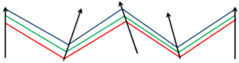
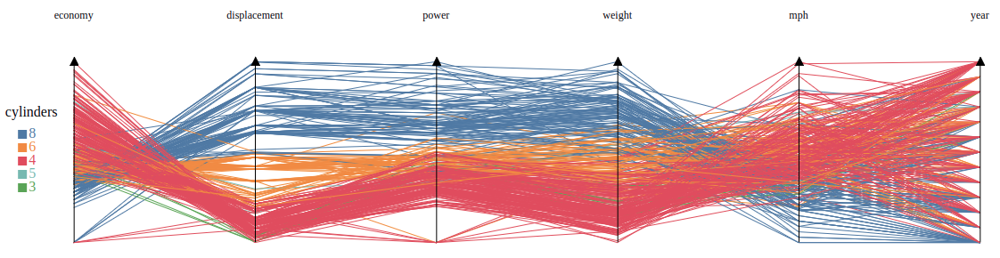

# GLCVis: General Line Coordinates Visualization

<a></a>

**GLCVis** (or **GLCVis.js**) is a JavaScript library for visualizing data using General Lines Coordinates (or GLC) developmented by <a href="http://www.cwu.edu/~borisk/">Boris Kovalerchuk</a>. GLCVis helps you bring data to life using SVG and HTML. GLCVis combines new multi-dimensional visualization techniques and interaction techniques for a effective data exploration, giving you the full capabilities of modern browsers. GLCVis is based on D3js.


   
## Installing

 Download the [latest release](https://github.com/LeandroLuque/GLCvis/tree/master/dist). The released bundle supports anonymous AMD, CommonJS, and vanilla environments.For example:

```html
<script src="glcvis.js"></script>
```

For the minified version:

```html
<script src="glcvis.min.js"></script>
```


## API Reference

* [GLC](#glc)
* [Radial](#radial)
* [InLine](#inline)
* [Circular](#circular)
* [Sequential Generic](#curves)
* [Polygon](#polygon)
* [Bush](#bush)
* [Non-Sequential Generic](#symbols)
* [Parallel Coordinates](#custom-symbol-types)
* [Interacions](#interactions)


### GLC

```js
var chart = glc.newChart({
    data,
    width,
    height, 
    selector, 
    type, 
    dimensions,
    target, 
    dynamic
});

chart.draw();
```

Generates a new GLC plot for the given array of *data*, returning an object corresponding to specified *type*. The rest of the arguments are requered; they are simply propagated to the corresponding class with the `this` object.

* `data` - input data array. .
* `width` - width of the SVG.
* `height` - height of the SVG.
* `select` - accesor by ID to the DOM element container. Also, it accepts body as valid accesor.
* `type` - some of the possible options to generate a GLC plot. It must be 'radial' | 'parallel' | 'circular' | 'bush' | 'inline' | 'polygon' | 'seq-generic' | 'nseq-generic' . 
* `dimensions` - array of fields name of the dimensions of the dataset.
* `target` - field name of the label column of the dataset. If *target* is null (dataset has not ground label) the polylines are not colorized (useful for cluster analysis).
* `dynamic` - boolean value to determine if data item is drawn statically or dynamically

```js
    chart.setOpacity(value)
```
When *value* is specified, the opacity of the items is changed. Valus must be in range of [0, 1]


```js
    chart.colorize(boolean)
```
When *boolean* is true, the items are colorized follow by the *target* field. When it is *false*, the items are colorized using black color.

```js
    chart.getAxis()
```
Returns collection of axis. Collection is a D3 selection.

```js
    chart.getItems()
```
Returns collection of items. Collection is a D3 selection.


### Radial

[](http://bl.ocks.org/mbostock/8878e7fd82034f1d63cf)


```js
chart.setRadius(value)
```
When *value* is specified, the axis are located that distance ralative of the origin.

```js
chart.setCurve(value)
```
When *value* is specified, the items are drawn with curves or straight lines. *value* must be <'CURVE' | 'LINE'>

### Inline

[](http://bl.ocks.org/mbostock/8878e7fd82034f1d63cf)

```js
chart.compareClasses(class1, class2)
```
When *class1* and *class2* are specified, the items corresponding to *class1* are drawn above and the items corresponding to the *class2* are drawn below.

```js
chart.focusClass(class)
```
When *class* is specififed, the items corresponding to *class* are drawn above and items of the rest of the classes are drawn below.

```js
chart.setLine(value)
```
When *value* is specified, the items are drawn with curves or straight lines. *value* must be <'CURVE' | 'TRIANGULAR'>

### Circular

[](http://bl.ocks.org/mbostock/8878e7fd82034f1d63cf)

```js
chart.setRadius(value)
```
When *value* is specified, the axis are located that distance ralative of the origin.


### Sequential Generic
[](http://bl.ocks.org/mbostock/8878e7fd82034f1d63cf)


```js
chart.setOrientations(value)
```
*value* is an array of integers between [0, 360] and its length must be match with the lenght of *dimensions*. When *value* is specified, the orientation of each axis is set according to the *value*<sub>i</sub>. Otherwise, the orientations are calculated randomly. 

### Polygon

[](http://bl.ocks.org/mbostock/8878e7fd82034f1d63cf)


### Bush

[](http://bl.ocks.org/mbostock/8878e7fd82034f1d63cf)

### Non-Sequential Generic
[](http://bl.ocks.org/mbostock/8878e7fd82034f1d63cf)

```js
chart.setOrientations(<[value]>)
```
*value* is an array of integers between [0, 360] and its length must be match with the lenght of *dimensions*. When *value* is specified, the orientation of each axis is set according to the *value*<sub>i</sub>. Otherwise, the orientations are calculated randomly. 

### Parallel Coordinates
[](http://bl.ocks.org/mbostock/8878e7fd82034f1d63cf)

### Interactions

The library provide 3 basic interactions to manipulate the chart:

* brush - allowing brush the axis
* pan - move the chart
* zoom - zoom out/zoom in when it is required.

## Example


